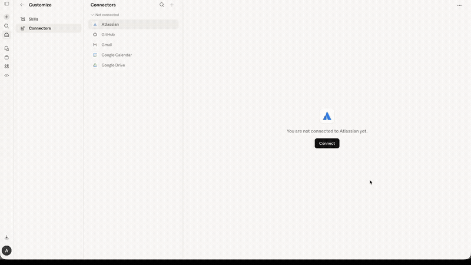

# MCP Telegram

[](https://www.npmjs.com/package/@overpod/mcp-telegram)
[](https://www.npmjs.com/package/@overpod/mcp-telegram)
[](https://nodejs.org/)
[](https://www.typescriptlang.org/)
[](https://modelcontextprotocol.io/)
[](LICENSE)
[](https://glama.ai/mcp/servers/overpod/mcp-telegram)

> **Hosted version available!** Don't want to self-host? Use [mcp-telegram.com](https://mcp-telegram.com) -- connect Telegram to Claude.ai or ChatGPT in 30 seconds with QR code. No API keys needed.

<p align="center">
  
</p>

An MCP (Model Context Protocol) server that connects AI assistants like Claude to Telegram via the MTProto protocol. Unlike bots, this runs as a **userbot** -- it operates under your personal Telegram account using [GramJS](https://github.com/nicedoc/gramjs), giving full access to your chats, contacts, and message history.

## Features

- **59 tools** -- the most comprehensive Telegram MCP server available
- **MTProto protocol** -- direct Telegram API access, not the limited Bot API
- **Userbot** -- operates as your personal account, not a bot
- **Full-featured** -- messaging, reactions, polls, scheduled messages, stickers, media, contacts, and more
- **Forum Topics** -- list topics, read per-topic messages, send to specific topics, per-topic unread counts
- **Stickers** -- search sticker sets, browse installed/recent stickers, send stickers to any chat
- **Account management** -- update profile, manage privacy settings, sessions, auto-delete timers
- **Global search** -- search messages across all chats at once
- **QR code login** -- authenticate by scanning a QR code in the Telegram app
- **Session persistence** -- login once, stay connected across restarts
- **Human-readable output** -- sender names are resolved, not just numeric IDs
- **Works with any MCP client** -- Claude Code, Claude Desktop, ChatGPT, Cursor, VS Code, Mastra, etc.

## Prerequisites

- **Node.js** 18 or later
- **Telegram API credentials** -- `API_ID` and `API_HASH` from [my.telegram.org](https://my.telegram.org)

## Quick Start

### 1. Get Telegram API credentials

1. Go to [my.telegram.org](https://my.telegram.org) and log in with your phone number.
2. Navigate to **API development tools**.
3. Create a new application (any name and platform).
4. Copy the **App api_id** and **App api_hash**.

### 2. Login

```bash
TELEGRAM_API_ID=YOUR_ID TELEGRAM_API_HASH=YOUR_HASH npx @overpod/mcp-telegram login
```

A QR code will appear in the terminal. Open Telegram on your phone, go to **Settings > Devices > Link Desktop Device**, and scan the code. The session is saved to `~/.mcp-telegram/session` and reused automatically.

> **Custom session path:** set `TELEGRAM_SESSION_PATH=/path/to/session` to store the session file elsewhere.

### 3. Add to Claude

```bash
claude mcp add telegram -s user \
  -e TELEGRAM_API_ID=YOUR_ID \
  -e TELEGRAM_API_HASH=YOUR_HASH \
  -- npx @overpod/mcp-telegram
```

That's it! Ask Claude to run `telegram-status` to verify.

### Multiple Accounts

Use `TELEGRAM_SESSION_PATH` to run separate Telegram accounts side by side:

```bash
# Login each account with a unique session path
TELEGRAM_API_ID=ID1 TELEGRAM_API_HASH=HASH1 TELEGRAM_SESSION_PATH=~/.mcp-telegram/session-work npx @overpod/mcp-telegram login
TELEGRAM_API_ID=ID2 TELEGRAM_API_HASH=HASH2 TELEGRAM_SESSION_PATH=~/.mcp-telegram/session-personal npx @overpod/mcp-telegram login
```

Then add each as a separate MCP server:

```bash
claude mcp add telegram-work -s user \
  -e TELEGRAM_API_ID=ID1 \
  -e TELEGRAM_API_HASH=HASH1 \
  -e TELEGRAM_SESSION_PATH=~/.mcp-telegram/session-work \
  -- npx @overpod/mcp-telegram

claude mcp add telegram-personal -s user \
  -e TELEGRAM_API_ID=ID2 \
  -e TELEGRAM_API_HASH=HASH2 \
  -e TELEGRAM_SESSION_PATH=~/.mcp-telegram/session-personal \
  -- npx @overpod/mcp-telegram
```

Each account gets its own session file — no conflicts.

### Proxy Support

If Telegram is blocked or you're running in a containerized environment (Docker, K3s), use a SOCKS5 or MTProxy:

```bash
# SOCKS5 proxy
TELEGRAM_PROXY_IP=127.0.0.1 \
TELEGRAM_PROXY_PORT=10808 \
npx @overpod/mcp-telegram

# MTProxy
TELEGRAM_PROXY_IP=proxy.example.com \
TELEGRAM_PROXY_PORT=443 \
TELEGRAM_PROXY_SECRET=ee00000000000000000000000000000000 \
npx @overpod/mcp-telegram
```

| Variable | Description |
|----------|-------------|
| `TELEGRAM_PROXY_IP` | Proxy server address |
| `TELEGRAM_PROXY_PORT` | Proxy server port |
| `TELEGRAM_PROXY_SOCKS_TYPE` | `4` or `5` (default: `5`) |
| `TELEGRAM_PROXY_SECRET` | MTProxy secret (enables MTProxy mode) |
| `TELEGRAM_PROXY_USERNAME` | Optional proxy auth |
| `TELEGRAM_PROXY_PASSWORD` | Optional proxy auth |

## Installation Options

### npx (recommended, zero install)

No need to clone or install anything. Just use `npx @overpod/mcp-telegram`.

### Global install

```bash
npm install -g @overpod/mcp-telegram
mcp-telegram          # run server
mcp-telegram login    # QR login
```

### Pre-built binary (no runtime needed)

Download from [Releases](https://github.com/overpod/mcp-telegram/releases) — standalone single-file binaries, zero dependencies:

| Platform | Server | Login CLI |
|----------|--------|-----------|
| Linux x64 | `mcp-telegram-linux-x64` | `mcp-telegram-login-linux-x64` |
| Linux ARM64 | `mcp-telegram-linux-arm64` | `mcp-telegram-login-linux-arm64` |
| macOS x64 | `mcp-telegram-darwin-x64` | `mcp-telegram-login-darwin-x64` |
| macOS ARM64 | `mcp-telegram-darwin-arm64` | `mcp-telegram-login-darwin-arm64` |
| Windows x64 | `mcp-telegram-windows-x64.exe` | `mcp-telegram-login-windows-x64.exe` |

```bash
# Download (example for Linux x64)
curl -L -o mcp-telegram https://github.com/overpod/mcp-telegram/releases/latest/download/mcp-telegram-linux-x64
curl -L -o mcp-telegram-login https://github.com/overpod/mcp-telegram/releases/latest/download/mcp-telegram-login-linux-x64
chmod +x mcp-telegram mcp-telegram-login

# Login
TELEGRAM_API_ID=YOUR_ID TELEGRAM_API_HASH=YOUR_HASH ./mcp-telegram-login

# Run
./mcp-telegram
```

### From source

```bash
git clone https://github.com/overpod/mcp-telegram.git
cd mcp-telegram
npm install && npm run build
```

### Docker

```bash
docker build -t mcp-telegram https://github.com/overpod/mcp-telegram.git
```

Login (interactive terminal required):

```bash
docker run -it --rm \
  -e TELEGRAM_API_ID=YOUR_ID \
  -e TELEGRAM_API_HASH=YOUR_HASH \
  -v ~/.mcp-telegram:/root/.mcp-telegram \
  --entrypoint node mcp-telegram dist/qr-login-cli.js
```

Run the MCP server:

```bash
docker run -i --rm \
  -e TELEGRAM_API_ID=YOUR_ID \
  -e TELEGRAM_API_HASH=YOUR_HASH \
  -v ~/.mcp-telegram:/root/.mcp-telegram \
  mcp-telegram
```

> **Note**: Login must be done once via terminal. After that, the session is persisted in `~/.mcp-telegram` and reused automatically.

## Usage with MCP Clients

### Claude Code (CLI)

```bash
claude mcp add telegram -s user \
  -e TELEGRAM_API_ID=YOUR_ID \
  -e TELEGRAM_API_HASH=YOUR_HASH \
  -- npx @overpod/mcp-telegram
```

### Claude Desktop

1. Open your config file:
   - **macOS**: `~/Library/Application Support/Claude/claude_desktop_config.json`
   - **Windows**: `%APPDATA%\Claude\claude_desktop_config.json`

2. Add the Telegram server:

```json
{
  "mcpServers": {
    "telegram": {
      "command": "npx",
      "args": ["@overpod/mcp-telegram"],
      "env": {
        "TELEGRAM_API_ID": "YOUR_ID",
        "TELEGRAM_API_HASH": "YOUR_HASH"
      }
    }
  }
}
```

3. Restart Claude Desktop.

4. Ask Claude: **"Run telegram-login"** -- a QR code will appear. If the image is not visible, it's also saved to `~/.mcp-telegram/qr-login.png`. Scan it in Telegram (**Settings > Devices > Link Desktop Device**).

5. Ask Claude: **"Run telegram-status"** to verify the connection.

> **Note**: No terminal required! Login works entirely through Claude Desktop.

### Claude Desktop (Binary)

Same setup, but using the pre-built binary instead of npx:

```json
{
  "mcpServers": {
    "telegram": {
      "command": "/path/to/mcp-telegram",
      "env": {
        "TELEGRAM_API_ID": "YOUR_ID",
        "TELEGRAM_API_HASH": "YOUR_HASH"
      }
    }
  }
}
```

### Claude Desktop (Docker)

1. Login via terminal first (see [Docker](#docker) section above).

2. Add to your config file:

```json
{
  "mcpServers": {
    "telegram": {
      "command": "docker",
      "args": [
        "run", "-i", "--rm",
        "-e", "TELEGRAM_API_ID=YOUR_ID",
        "-e", "TELEGRAM_API_HASH=YOUR_HASH",
        "-v", "~/.mcp-telegram:/root/.mcp-telegram",
        "mcp-telegram"
      ]
    }
  }
}
```

3. Restart Claude Desktop. Ask Claude: **"Run telegram-status"** to verify.

### Cursor / VS Code

Add the same JSON config above to your MCP settings (Cursor Settings > MCP, or VS Code MCP config).

### Mastra

```typescript
import { MCPClient } from "@mastra/mcp";

const telegramMcp = new MCPClient({
  id: "telegram-mcp",
  servers: {
    telegram: {
      command: "npx",
      args: ["@overpod/mcp-telegram"],
      env: {
        TELEGRAM_API_ID: process.env.TELEGRAM_API_ID!,
        TELEGRAM_API_HASH: process.env.TELEGRAM_API_HASH!,
      },
    },
  },
});
```

## Tools (59)

All tools are auto-discoverable via MCP — your AI client will see the full list with parameters and descriptions when connected.

| Category | Tools |
|----------|-------|
| **Auth** | `telegram-status`, `telegram-login` |
| **Messaging** | `telegram-send-message`, `telegram-edit-message`, `telegram-delete-message`, `telegram-forward-message`, `telegram-send-scheduled` |
| **Reading** | `telegram-list-chats`, `telegram-read-messages`, `telegram-search-messages`, `telegram-search-global`, `telegram-search-chats`, `telegram-get-unread`, `telegram-mark-as-read` |
| **Forum Topics** | `telegram-list-topics`, `telegram-read-topic-messages` |
| **Polls** | `telegram-create-poll` |
| **Reactions** | `telegram-send-reaction`, `telegram-get-reactions` |
| **Stickers** | `telegram-send-sticker`, `telegram-get-installed-stickers`, `telegram-get-recent-stickers`, `telegram-get-sticker-set`, `telegram-search-sticker-sets` |
| **Media** | `telegram-send-file`, `telegram-download-media`, `telegram-get-profile-photo` |
| **Groups** | `telegram-create-group`, `telegram-edit-group`, `telegram-invite-to-group`, `telegram-join-chat`, `telegram-leave-group`, `telegram-kick-user`, `telegram-ban-user`, `telegram-unban-user`, `telegram-set-admin`, `telegram-remove-admin`, `telegram-get-my-role` |
| **Chat Info** | `telegram-get-chat-info`, `telegram-get-chat-members`, `telegram-get-chat-folders` |
| **Invite Links** | `telegram-create-invite-link`, `telegram-get-invite-links`, `telegram-revoke-invite-link` |
| **Contacts** | `telegram-get-contacts`, `telegram-add-contact`, `telegram-get-contact-requests` |
| **Moderation** | `telegram-block-user`, `telegram-unblock-user`, `telegram-report-spam` |
| **Profiles** | `telegram-get-profile`, `telegram-update-profile` |
| **Account** | `telegram-get-sessions`, `telegram-terminate-session`, `telegram-set-privacy`, `telegram-set-auto-delete` |
| **Pinning** | `telegram-pin-message`, `telegram-unpin-message` |
| **Chat Settings** | `telegram-mute-chat` |

> **Tip**: Ask your AI assistant *"What Telegram tools are available?"* to get the full list with parameters and descriptions.

## Development

```bash
npm run dev        # Start with file watching (tsx)
npm start          # Start the MCP server
npm run login      # QR code login in terminal
npm run build      # Compile TypeScript
npm run lint       # Check code with Biome
npm run lint:fix   # Auto-fix lint issues
npm run format     # Format code with Biome
```

## Project Structure

```
src/
  index.ts            -- MCP server entry point
  telegram-client.ts  -- TelegramService class (GramJS wrapper)
  qr-login-cli.ts     -- CLI utility for QR code login
  tools/              -- Modular tool definitions
    auth.ts           -- Connection & login
    messages.ts       -- Send, read, search, edit, delete, forward
    chats.ts          -- Chat listing, group management, admin
    contacts.ts       -- Contacts, profiles, moderation
    media.ts          -- Files, photos, downloads
    reactions.ts      -- Reactions
    extras.ts         -- Pin, schedule, polls, topics
    stickers.ts       -- Sticker sets, send, search, browse
    account.ts        -- Sessions, privacy, auto-delete, profile, chat mute/folders, invite links
    shared.ts         -- Shared utilities
```

## Tech Stack

- **[TypeScript](https://www.typescriptlang.org/)** -- ES2022, ESM modules
- **[GramJS](https://github.com/nicedoc/gramjs)** (`telegram`) -- Telegram MTProto client
- **[@modelcontextprotocol/sdk](https://modelcontextprotocol.io/)** -- MCP server framework
- **[Zod](https://zod.dev/)** -- Runtime schema validation for tool parameters
- **[Biome](https://biomejs.dev/)** -- Linter and formatter
- **[tsx](https://tsx.is/)** -- TypeScript execution without a build step
- **[dotenv](https://github.com/motdotla/dotenv)** -- Environment variable management

## Troubleshooting

### AUTH_KEY_DUPLICATED

A Telegram session can only be used by **one process at a time**. If you get `AUTH_KEY_DUPLICATED`, it means another process is already using the same session file.

**Solution**: Create separate sessions for each environment:

```bash
# Local development
TELEGRAM_SESSION_PATH=~/.mcp-telegram/session-local npx @overpod/mcp-telegram login

# Production server
TELEGRAM_SESSION_PATH=~/.mcp-telegram/session-prod npx @overpod/mcp-telegram login
```

Then set `TELEGRAM_SESSION_PATH` in each environment's MCP config accordingly.

## Security

- API credentials are stored in `.env` (gitignored)
- Session is stored in `~/.mcp-telegram/session` with `0600` permissions (owner-only access)
- Session directory is created with `0700` permissions
- Phone number is **not required** -- QR-only authentication
- No data is sent to third-party services -- all communication goes directly to Telegram servers via MTProto
- QR login codes are generated locally and never leave your machine
- **One session per process** -- using the same session in multiple processes simultaneously causes `AUTH_KEY_DUPLICATED` errors (see [Troubleshooting](#troubleshooting))
- This is a **userbot** (personal account), not a bot -- respect the [Telegram Terms of Service](https://core.telegram.org/api/terms)

## License

MIT
